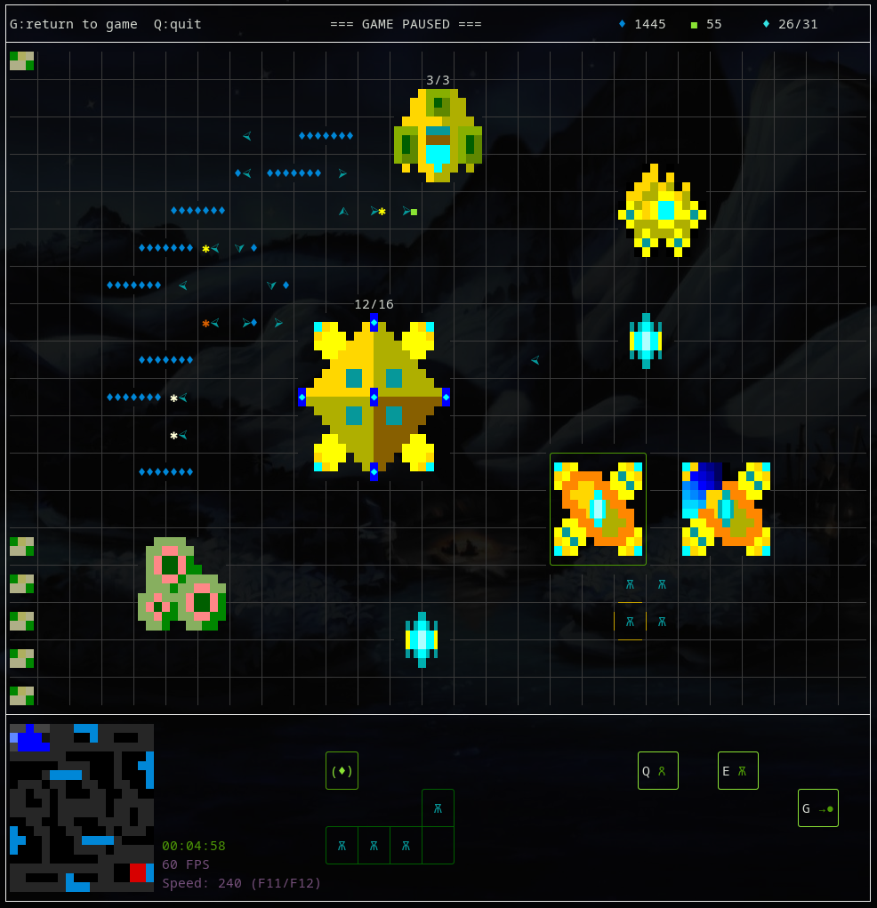

# sc2too - StarCraft II in a GNU/Linux terminal (well, kind of!)

**Features**:

* Protoss only!
* Buildings: nexus, gateway, assimilator, pylon, cybernetics core.
* Units: probe, zealot, stalker.
* Abilities: move, gather, set rally point, chrono boost.
* Control groups, camera positions, minimap, production and research queues.
* **TODO: Attack, multiplayer or AI are not implemented (yet?).**

**Important notes**:

* Grid hotkeys are used.
* This game runs in a terminal, but it takes over your X window system. To release it, press **F10** (menu), which pauses the game.
* It doesn't work properly with any window manager or terminal. It interacts pretty badly with GNOME. I have the best results with XFCE and xfce4-terminal.
* You may need to install some fonts to properly render all characters. E.g. in Debian/Ubuntu, install the package 'fonts-noto'. It doesn't seem to be needed in Manjaro.

**Build dependencies** (Ubuntu):

    build-essential scons libncurses-dev libx11-dev

**Building**:

    git clone git@github.com:beatmax/sc2too.git
    cd sc2too/
    git submodule init
    git submodule update
    make
